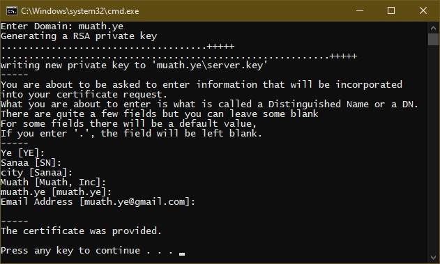
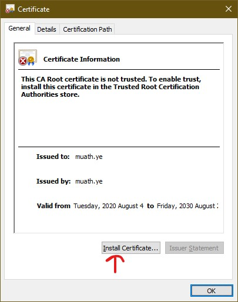
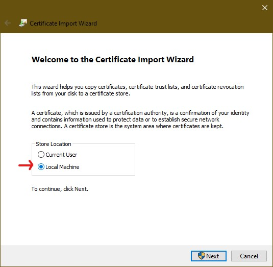
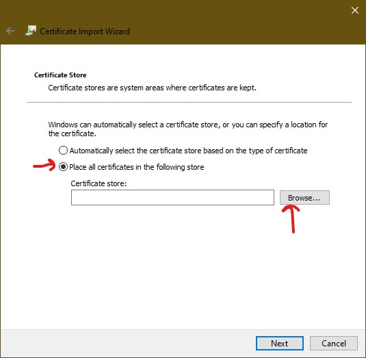
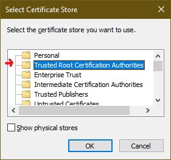
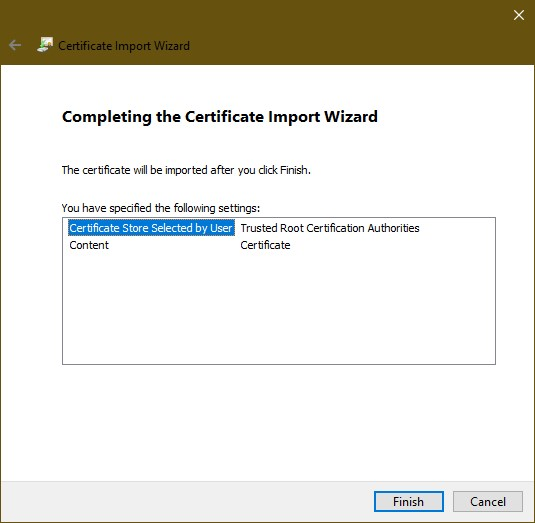
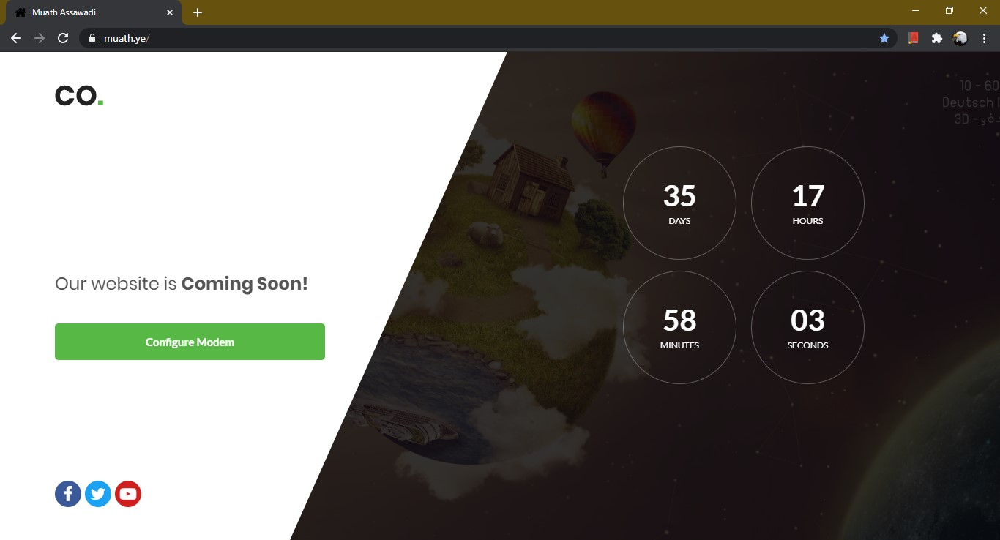

# Create a Valid SSL Certificate in localhost for XAMPP

In this tutorial I will explain how to create a valid SSL certificate locally to be used in XAMPP in Windows.

In this step we are going to crate SSL and setup ```https://muath.ye``` website.

## 1. Navigate to Apache directory in XAMPP.

In regular install it’s in ```C:\xampp\apache```.

## 2. Create a folder in that page.

This is where we will store our cert.

In this example I will create "ssl" folder. So we will have ```C:\xampp\apache\ssl```

## 3. Add this files.


All ```cert.conf``` and ```make-cert.bat``` inside ```C:\xampp\apache\ssl``` folder.

[cert.conf](cert.conf)

[make-cert.bat](make-cert.bat)

## 4. Edit ```cert.conf``` As Following and Run ```make-cert.bat```

```conf
[ req ]

default_bits        = 2048
default_keyfile     = server-key.pem
distinguished_name  = subject
req_extensions      = req_ext
x509_extensions     = x509_ext
string_mask         = utf8only

[ subject ]

countryName                 = Ye
countryName_default         = YE

stateOrProvinceName         = Sanaa
stateOrProvinceName_default = SN

localityName                = city
localityName_default        = Sanaa

organizationName            = Muath
organizationName_default    = Muath, Inc

commonName                  = muath.ye
commonName_default          = muath.ye

emailAddress                = Email Address
emailAddress_default        = muath.ye@gmail.com

[ x509_ext ]

subjectKeyIdentifier   = hash
authorityKeyIdentifier = keyid,issuer

basicConstraints       = CA:FALSE
keyUsage               = digitalSignature, keyEncipherment
subjectAltName         = @alternate_names
nsComment              = "OpenSSL Generated Certificate"

[ req_ext ]

subjectKeyIdentifier = hash

basicConstraints     = CA:FALSE
keyUsage             = digitalSignature, keyEncipherment
subjectAltName       = @alternate_names
nsComment            = "OpenSSL Generated Certificate"

[ alternate_names ]

DNS.1       = muath.ye
```

You can change ```muath.ye``` to your domain name.

Double click the ```make-cert.bat``` and enter ```muath.ye``` _the domain should be the same as the one you entered in ```cert.conf```_, and just do enter in all questions since we already set the default from ```cert.conf```.



## 5. Install the cert in windows.

After that, you will see ```muath.ye``` folder created. In that folder we will have ```server.crt``` and ```server.key```. 

This ```server.crt``` our SSL certificate which will install in windows, just by double click the ```server.crt```



Click in ```Install Certificate...``` button



Choose ```local Machine``` and then ```Next```



Choose ```Place all certificates in the following store``` and then ```Browse``` and then ```Next```



Choose ``` Trusted Root Certification Authorities``` and then click ```OK```.



Click ```Next``` and then ```Finish```

> So now this certificate is installed and trusted in Windows.

We still need to use this certificate in XAMPP.

## 6. Add the ```muath.ye``` site in Windows hosts

- Open notepad as administrator
- Open the following file ```C:\Windows\System32\drivers\etc\hosts```
- Add the following line at the bottom
- ```127.0.0.1 muath.ye``` _note ```muath.ye``` is your domain.

This will tell windows to load XAMPP when we visit http://muath.ye You can try and it will show XAMPP dashboard page.

## 7. Add the site in XAMPP conf.

We need to enable SSL for this domain and let XAMPP know where we store the SSL Cert. So we need to edit ```C:\xampp\apache\conf\extra\httpd-xampp.conf```

And add this code at the bottom:

```conf
## muath.ye
<VirtualHost *:80>
    DocumentRoot "C:\muath.ye"
    ServerName muath.ye
    ServerAlias *.muath.ye
    <Directory "C:\muath.ye">
        Allow from all
        Require all granted
        Options Indexes
    </Directory>
</VirtualHost>
<VirtualHost *:443>
    DocumentRoot "C:/muath.ye"
    ServerName muath.ye
    ServerAlias *.muath.ye
    SSLEngine on
    SSLCertificateFile "crt/muath.ye/server.crt"
    SSLCertificateKeyFile "crt/muath.ye/server.key"
    <Directory "C:\muath.ye">
        Allow from all
        Require all granted
        Options Indexes
    </Directory>
</VirtualHost>
```

After that, you will need to restart Apache in XAMPP.  It’s very simple, simply open XAMPP Control Panel and Stop and then start Apache Module.

Now open the browser and enter ```muath.ye``` url

